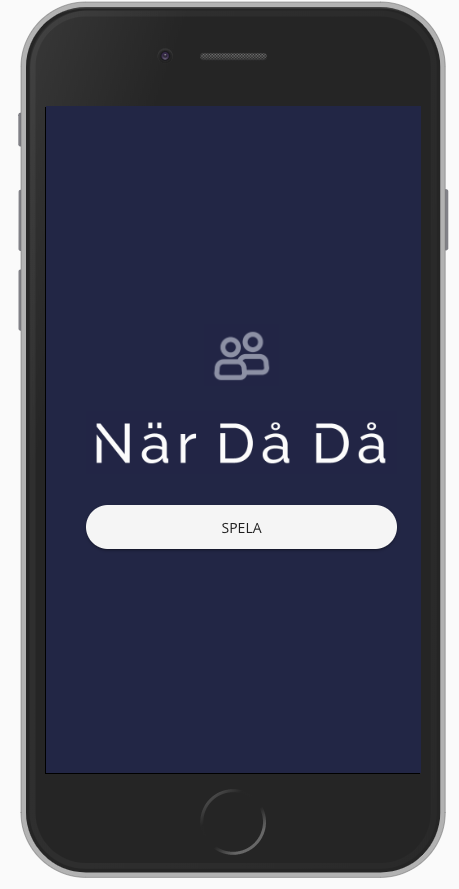

När Då Då / When Was It
=====

## How to get started

In terminal:
```
$ git clone git@github.com:lindbergan/whenwasit.git
$ yarn serve
```
`yarn serve` will start the project. Go to `localhost:8080` to view application.

## Screenshots

